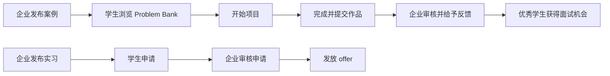
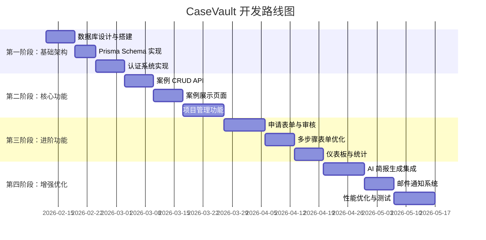

# CaseVault 平台二次开发可行性分析报告

## 📋 文档概述

**项目名称**: CaseVault - 真实世界 AI 项目对接平台  
**分析对象**: `livinglab.html` 原型系统  
**文档目的**: 为后续数据库对接、功能完善提供技术指导和实施路线  
**创建日期**: 2026-02-12  

---

## 一、系统概览

### 1.1 产品定位

CaseVault 是一个连接**企业真实需求**与**学生实践能力**的双边平台，核心功能包括:

- **问题银行 (Problem Bank)**: 企业提供真实业务场景的 AI 应用案例
- **实习机会 (Internships)**: 企业发布实习岗位
- **暑期项目 (Summer Programs)**: 大学/机构提供的培训项目
- **项目管理 (My Projects)**: 学生追踪项目进度和提交成果

### 1.2 用户角色

| 角色 | 权限 | 核心诉求 |
|------|------|----------|
| **🎓 Student** | 浏览案例、申请实习/项目、提交作品 | 获取实战经验、丰富简历、争取工作机会 |
| **🏢 Organization** | 发布案例、管理机会、查看学生作品 | 获得解决方案、招募人才、品牌曝光 |

### 1.3 使用场景



---

## 二、技术架构分析

### 2.1 当前架构特点

```
┌─────────────────────────────────────┐
│         Single HTML File            │
│  ┌──────────┬──────────┬──────────┐ │
│  │   CSS    │   HTML   │ JavaScript│ │
│  │  (内联)  │  (动态)  │  (Vanilla)│ │
│  └──────────┴──────────┴──────────┘ │
└─────────────────────────────────────┘
           ↓
    localStorage (临时)
           ↓
      无后端数据库
```

**技术栈**:
- **前端框架**: 纯 Vanilla JS,无框架依赖
- **样式方案**: CSS Variables + 内联样式
- **状态管理**: 全局 `state` 对象 (内存存储)
- **渲染模式**: 基于 `innerHTML` 的模板字符串渲染
- **数据存储**: 无持久化 (刷新后数据丢失)

### 2.2 代码结构分析

#### 核心模块划分

```javascript
// 1. 数据层 (Data Layer)
const cases = [...]        // 8 个示例案例
const internships = [...]  // 5 个实习机会
const programs = [...]     // 4 个暑期项目

// 2. 状态层 (State Management)
let state = {
  role: 'student',              // 当前角色
  page: 'cases',                // 当前页面
  filters: {...},               // 筛选条件
  myProjects: [],               // 我的项目
  appliedInternships: [],       // 已申请实习
  appliedPrograms: [],          // 已申请项目
  orgSubmittedCases: [],        // 企业提交的案例
  orgPostedOps: [],             // 企业发布的机会
  caseFormStep: 0,              // 表单步骤
  caseFormData: {}              // 表单数据
}

// 3. 渲染层 (Render Engine)
render()              // 总渲染函数
  ├─ renderNav()      // 导航栏
  └─ renderPage()     // 页面内容
      ├─ renderCases()
      ├─ renderInternships()
      ├─ renderPrograms()
      ├─ renderMyProjects()
      ├─ renderDashboard()
      ├─ renderSubmitCase()
      ├─ renderPostOp()
      └─ renderStudentWork()

// 4. 交互层 (User Interactions)
├─ 模态框系统：showModal(), closeModal()
├─ Toast 通知：showToast()
├─ 表单验证：caseFormNext(), submitOpportunity()
└─ 数据操作：confirmStartProject(), submitInternApp()
```

### 2.3 组件系统

#### UI 组件清单

| 组件类型 | 数量 | 复杂度 | 复用性 |
|---------|------|--------|--------|
| **卡片组件** | 7 种 | ⭐⭐ | 高 |
| **表单组件** | 6 种 | ⭐⭐ | 高 |
| **模态框** | 12+ | ⭐⭐⭐ | 中 |
| **筛选器** | 2 组 | ⭐ | 高 |
| **统计卡片** | 4 种 | ⭐ | 高 |
| **表格** | 2 个 | ⭐ | 中 |
| **进度条** | 1 个 | ⭐ | 高 |
| **Toast** | 3 种状态 | ⭐ | 高 |

#### 关键组件代码示例

```javascript
// Card 组件模式
function caseCard(c) {
  const dc = c.difficulty === 'Beginner' ? 'green' : 
             c.difficulty === 'Intermediate' ? 'yellow' : 'red';
  const cc = {solved:'purple',open:'blue',process:'yellow',policy:'pink',content:'green'}[c.category] || 'purple';
  
  return `<div class="card" onclick="openCaseDetail(${c.id})">
    <div class="company-badge">
      <div class="company-avatar" style="background:${c.color}">${c.logo}</div>
      <span style="font-size:0.82rem;color:var(--t2)">${c.company} · ${c.dept}</span>
    </div>
    <h3>${c.title}</h3>
    <div class="card-meta">
      <span class="badge badge-${cc}">${c.category}</span>
      <span class="badge badge-${dc}">${c.difficulty}</span>
      <span class="badge badge-purple">~${c.hours}h</span>
    </div>
    <p class="card-desc">${c.scenario}</p>
    <div class="card-tags">
      ${c.skills.map(s => `<span class="tag">${s}</span>`).join('')}
    </div>
    <div class="card-footer">
      <span>👥 ${c.submissions} students working</span>
      <span>→ View Details</span>
    </div>
  </div>`;
}
```

---

## 三、数据结构设计

### 3.1 核心实体关系图 (ERD)

```mermaid
erDiagram
    USER ||--o{ PROJECT : "参与"
    USER ||--o{ APPLICATION : "申请"
    ORGANIZATION ||--o{ CASE : "发布"
    ORGANIZATION ||--o{ OPPORTUNITY : "发布"
    CASE ||--o{ SUBMISSION : "接收"
    CASE ||--o{ PROJECT : "基于"
    
    USER {
        string id PK
        string email
        string name
        string role "student|organization"
        json profile
        timestamp createdAt
    }
    
    ORGANIZATION {
        string id PK
        string name
        string industry
        int size
        string contactEmail
        timestamp createdAt
    }
    
    CASE {
        string id PK
        string title
        string organizationId FK
        string department
        string category "solved|open|process|policy|content"
        string difficulty "Beginner|Intermediate|Advanced"
        string scenario
        string problem
        string existingSolution
        string deliverable
        string publicData
        int estimatedHours
        string[] skills
        int submissions
        string status "active|closed"
        timestamp createdAt
    }
    
    PROJECT {
        string id PK
        string caseId FK
        string userId FK
        string teamType "solo|pair|team"
        string goal
        int progress "0-100"
        string status "in-progress|submitted|completed"
        date startDate
        date submitDate
        json submission {summary, findings, url, shareWithCompany}
    }
    
    OPPORTUNITY {
        string id PK
        string type "internship|program"
        string organizationId FK
        string title
        string description
        string location
        string duration
        string stipend
        date deadline
        string[] requirements
        string[] perks
        int applicants
        timestamp createdAt
    }
    
    APPLICATION {
        string id PK
        string opportunityId FK
        string userId FK
        string fullName
        string email
        string university
        string statement
        string[] projectIds
        string status "pending|reviewed|accepted|rejected"
        timestamp createdAt
    }
```

### 3.2 详细字段定义

#### 3.2.1 Cases (案例表)

```typescript
interface Case {
  id: string;                    // UUID
  title: string;                 // 案例标题 (最多 150 字符)
  organizationId: string;        // 外键：企业 ID
  department: string;            // 部门 (Marketing/Operations/HR 等)
  category: CaseCategory;        // 案例类型
  difficulty: DifficultyLevel;   // 难度等级
  scenario: string;              // 业务场景描述 (500-2000 字符)
  problem: string;               // 核心问题 (200-1000 字符)
  existingSolution: string;      // 现有解决方案 (可选)
  deliverable: string;           // 期望交付物 (200-500 字符)
  publicData: string;            // 可公开数据 (可选)
  estimatedHours: number;        // 预估工时 (1-100)
  skills: string[];              // 相关技能标签
  submissions: number;           // 提交数量 (计数器)
  status: 'draft' | 'active' | 'closed';
  aiGeneratedBrief?: string;     // AI 生成的项目简报
  createdAt: Date;
  updatedAt: Date;
}

enum CaseCategory {
  SOLVED = 'solved',         // ✅ 已解决
  OPEN = 'open',             // 💬 开放中
  PROCESS = 'process',       // ⚙️ 流程优化
  POLICY = 'policy',         // 📜 政策制定
  CONTENT = 'content'        // 📣 内容创作
}

enum DifficultyLevel {
  BEGINNER = 'Beginner',     // 🟢 入门
  INTERMEDIATE = 'Intermediate', // 🟡 中级
  ADVANCED = 'Advanced'      // 🔴 高级
}
```

#### 3.2.2 Projects (项目表)

```typescript
interface Project {
  id: string;
  caseId: string;                    // 外键：案例 ID
  userId: string;                    // 外键：用户 ID
  teamType: 'solo' | 'pair' | 'team';
  teamMembers?: string[];            // 团队成员 IDs
  goal: string;                      // 学习目标 (可选)
  progress: number;                  // 进度 0-100
  status: 'not-started' | 'in-progress' | 'submitted' | 'completed';
  startDate: Date;
  submission?: {
    summary: string;
    keyFindings: string;
    demoUrl?: string;
    repositoryUrl?: string;
    shareWithCompany: boolean;
    submittedAt: Date;
  };
  feedback?: {
    rating: number;                  // 1-5 星
    comment: string;
    reviewedBy: string;              // 企业 ID
    reviewedAt: Date;
  };
  createdAt: Date;
  updatedAt: Date;
}
```

#### 3.2.3 Applications (申请表)

```typescript
interface Application {
  id: string;
  opportunityId: string;             // 外键：机会 ID
  userId: string;                    // 外键：申请人 ID
  fullName: string;
  email: string;
  university: string;
  major?: string;
  portfolioUrl?: string;
  statement: string;                 // 申请动机
  relatedProjectIds: string[];       // 相关项目 IDs
  resumeUrl?: string;
  status: 'pending' | 'under-review' | 'accepted' | 'rejected';
  reviewNotes?: string;              // 审核备注 (企业可见)
  appliedAt: Date;
  reviewedAt?: Date;
}
```

---

## 四、数据库选型建议

### 4.1 推荐方案：PostgreSQL + Prisma ORM

**理由**:
1. **与现有项目技术栈一致**: Travel3 系列项目使用 Prisma
2. **关系型数据**: 用户、案例、项目之间存在复杂关系
3. **JSON 支持**: 某些字段 (如 submission, profile) 适合 JSON 存储
4. **扩展性**: 支持全文搜索、地理位置等高级功能
5. **类型安全**: Prisma 提供完整的 TypeScript 类型推导

### 4.2 备选方案对比

| 方案 | 优点 | 缺点 | 适用场景 |
|------|------|------|----------|
| **PostgreSQL + Prisma** | 类型安全、迁移方便、社区活跃 | 学习曲线 | ✅ 推荐方案 |
| **MongoDB + Mongoose** | 灵活 schema、快速迭代 | 事务支持弱、join 复杂 | 快速原型 |
| **Supabase** | 实时订阅、内置 Auth、免费额度高 | 厂商锁定 | 需要实时功能 |
| **Firebase** | 开箱即用、离线同步 | 查询能力弱、贵 | C 端小型应用 |

### 4.3 Prisma Schema 设计

```prisma
// schema.prisma

datasource db {
  provider = "postgresql"
  url      = env("DATABASE_URL")
}

generator client {
  provider = "prisma-client-js"
}

model User {
  id            String    @id @default(uuid())
  email         String    @unique
  name          String
  passwordHash  String
  role          UserRole  @default(STUDENT)
  profile       Json?     // { avatar, bio, university, major, skills[] }
  projects      Project[]
  applications  Application[]
  createdAt     DateTime  @default(now())
  updatedAt     DateTime  @updatedAt
  
  @@index([email])
  @@index([role])
}

model Organization {
  id            String    @id @default(uuid())
  name          String
  industry      String
  size          String    // "1-10", "11-50", "51-200", "200+"
  contactEmail  String
  cases         Case[]
  opportunities Opportunity[]
  createdAt     DateTime  @default(now())
  updatedAt     DateTime  @updatedAt
  
  @@index([industry])
}

model Case {
  id              String        @id @default(uuid())
  title           String
  organizationId  String
  organization  Organization  @relation(fields: [organizationId], references: [id])
  department      String
  category        CaseCategory
  difficulty      DifficultyLevel
  scenario        String        @db.Text
  problem         String        @db.Text
  existingSolution String?      @db.Text
  deliverable     String        @db.Text
  publicData      String?       @db.Text
  estimatedHours  Int
  skills          String[]
  submissions     Int           @default(0)
  status          CaseStatus    @default(ACTIVE)
  aiGeneratedBrief String?      @db.Text
  projects        Project[]
  createdAt       DateTime      @default(now())
  updatedAt       DateTime      @updatedAt
  
  @@index([organizationId])
  @@index([category])
  @@index([difficulty])
  @@index([status])
  @@index([createdAt])
}

model Project {
  id            String      @id @default(uuid())
  caseId        String
  case          Case        @relation(fields: [caseId], references: [id])
  userId        String
  user          User        @relation(fields: [userId], references: [id])
  teamType      TeamType
  teamMembers   String[]    // 用户 IDs
  goal          String?     @db.Text
  progress      Int         @default(0)
  status        ProjectStatus
  startDate     DateTime    @default(now())
  submission    Json?       // { summary, keyFindings, demoUrl, repositoryUrl, shareWithCompany, submittedAt }
  feedback      Json?       // { rating, comment, reviewedBy, reviewedAt }
  createdAt     DateTime    @default(now())
  updatedAt     DateTime    @updatedAt
  
  @@index([caseId])
  @@index([userId])
  @@index([status])
}

model Opportunity {
  id            String        @id @default(uuid())
  type          OpportunityType
  organizationId String
  organization  Organization  @relation(fields: [organizationId], references: [id])
  title         String
  description   String        @db.Text
  location      String
  duration      String
  stipend       String?
  deadline      DateTime
  requirements  String[]
  perks         String[]
  applicants    Int           @default(0)
  applications  Application[]
  createdAt     DateTime      @default(now())
  updatedAt     DateTime      @updatedAt
  
  @@index([type])
  @@index([organizationId])
  @@index([deadline])
}

model Application {
  id            String      @id @default(uuid())
  opportunityId String
  opportunity   Opportunity @relation(fields: [opportunityId], references: [id])
  userId        String
  user          User        @relation(fields: [userId], references: [id])
  fullName      String
  email         String
  university    String
  major         String?
  portfolioUrl  String?
  statement     String      @db.Text
  relatedProjectIds String[]
  resumeUrl     String?
  status        ApplicationStatus @default(PENDING)
  reviewNotes   String?     @db.Text
  appliedAt     DateTime    @default(now())
  reviewedAt    DateTime?
  
  @@index([opportunityId])
  @@index([userId])
  @@index([status])
}

enum UserRole {
  STUDENT
  ORGANIZATION
}

enum CaseCategory {
  SOLVED
  OPEN
  PROCESS
  POLICY
  CONTENT
}

enum DifficultyLevel {
  BEGINNER
  INTERMEDIATE
  ADVANCED
}

enum CaseStatus {
  DRAFT
  ACTIVE
  CLOSED
}

enum TeamType {
  SOLO
  PAIR
  TEAM
}

enum ProjectStatus {
  NOT_STARTED
  IN_PROGRESS
  SUBMITTED
  COMPLETED
}

enum OpportunityType {
  INTERNSHIP
  PROGRAM
}

enum ApplicationStatus {
  PENDING
  UNDER_REVIEW
  ACCEPTED
  REJECTED
}
```

---

## 五、API 接口设计

### 5.1 RESTful API 规范

**基础路径**: `/api/v1`

**响应格式**:
```typescript
// 成功响应
{
  success: true,
  data: { ... },
  meta: {
    total: 100,
    page: 1,
    limit: 20
  }
}

// 错误响应
{
  success: false,
  error: {
    code: "VALIDATION_ERROR",
    message: "Invalid input data",
    details: [
      { field: "email", message: "Invalid email format" }
    ]
  }
}
```

### 5.2 核心接口列表

#### 认证模块
```
POST   /auth/register          # 注册
POST   /auth/login             # 登录
POST   /auth/logout            # 登出
GET    /auth/me                # 获取当前用户
PUT    /auth/profile           # 更新资料
```

#### 案例模块
```
GET    /cases                  # 获取案例列表 (支持筛选、分页)
GET    /cases/:id              # 获取案例详情
POST   /cases                  # 创建案例 (仅企业)
PUT    /cases/:id              # 更新案例 (仅创建者)
DELETE /cases/:id              # 删除案例 (仅创建者)
POST   /cases/:id/start        # 开始项目
GET    /cases/:id/submissions  # 查看学生提交 (仅企业)
```

#### 项目模块
```
GET    /projects               # 我的项目列表
GET    /projects/:id           # 项目详情
PUT    /projects/:id/progress  # 更新进度
POST   /projects/:id/submit    # 提交作品
GET    /projects/:id/feedback  # 获取反馈 (仅学生)
POST   /projects/:id/feedback  # 给予反馈 (仅企业)
```

#### 机会模块
```
GET    /opportunities          # 获取机会列表
GET    /opportunities/:id      # 机会详情
POST   /opportunities          # 发布机会 (仅企业)
POST   /opportunities/:id/apply # 申请 (仅学生)
GET    /opportunities/:id/applications # 查看申请 (仅企业)
PUT    /applications/:id/status # 审核申请 (仅企业)
```

### 5.3 接口实现示例

```typescript
// app/api/cases/route.ts
import { NextRequest, NextResponse } from 'next/server';
import { prisma } from '@/lib/prisma';
import { auth } from '@/lib/auth';

export async function GET(request: NextRequest) {
  try {
    const { searchParams } = new URL(request.url);
    const category = searchParams.get('category');
    const difficulty = searchParams.get('difficulty');
    const search = searchParams.get('search');
    const page = parseInt(searchParams.get('page') || '1');
    const limit = parseInt(searchParams.get('limit') || '20');

    const where: any = { status: 'ACTIVE' };
    
    if (category && category !== 'all') {
      where.category = category;
    }
    if (difficulty && difficulty !== 'all') {
      where.difficulty = difficulty;
    }
    if (search) {
      where.OR = [
        { title: { contains: search, mode: 'insensitive' } },
        { organization: { name: { contains: search, mode: 'insensitive' } } },
        { department: { contains: search, mode: 'insensitive' } }
      ];
    }

    const [cases, total] = await Promise.all([
      prisma.case.findMany({
        where,
        include: {
          organization: { select: { name: true, industry: true } }
        },
        orderBy: { createdAt: 'desc' },
        skip: (page - 1) * limit,
        take: limit
      }),
      prisma.case.count({ where })
    ]);

    return NextResponse.json({
      success: true,
      data: cases,
      meta: { total, page, limit }
    });
  } catch (error) {
    console.error('Failed to fetch cases:', error);
    return NextResponse.json(
      { success: false, error: { message: 'Internal server error' } },
      { status: 500 }
    );
  }
}

export async function POST(request: NextRequest) {
  try {
    const session = await auth();
    if (!session?.user?.organizationId) {
      return NextResponse.json(
        { success: false, error: { message: 'Unauthorized' } },
        { status: 401 }
      );
    }

    const body = await request.json();
    
    // TODO: Add validation using Zod
    
    const caseData = await prisma.case.create({
      data: {
        ...body,
        organizationId: session.user.organizationId,
        status: 'ACTIVE'
      }
    });

    // TODO: Trigger AI brief generation
    
    return NextResponse.json({
      success: true,
      data: caseData
    }, { status: 201 });
  } catch (error) {
    console.error('Failed to create case:', error);
    return NextResponse.json(
      { success: false, error: { message: 'Internal server error' } },
      { status: 500 }
    );
  }
}
```

---

## 六、迁移路线图

### 6.1 阶段划分



### 6.2 详细任务清单

#### Phase 1: 基础架构 (2-3 周)

**Task 1.1: 数据库初始化**
- [ ] 安装 Prisma: `pnpm add prisma @prisma/client`
- [ ] 配置 DATABASE_URL 环境变量
- [ ] 编写完整 schema.prisma
- [ ] 执行迁移：`pnpm prisma migrate dev`
- [ ] 创建 Prisma Client 单例

**Task 1.2: 认证系统**
- [ ] 集成 NextAuth.js (或使用现有 Travel3 的 auth)
- [ ] 实现邮箱密码注册/登录
- [ ] 添加角色权限中间件
- [ ] 创建用户资料页面

**Task 1.3: 项目脚手架**
- [ ] 创建 Next.js 项目 (或使用现有 Travel3 子模块)
- [ ] 配置 Tailwind CSS (复用 livinglab.html 样式变量)
- [ ] 设置路由结构
- [ ] 创建布局组件

#### Phase 2: 核心功能 (3-4 周)

**Task 2.1: 案例管理**
- [ ] 实现案例列表页 (带筛选、搜索)
- [ ] 实现案例详情页
- [ ] 实现企业创建案例表单
- [ ] 实现案例编辑/删除功能
- [ ] 添加案例状态管理 (草稿/发布/关闭)

**Task 2.2: 项目系统**
- [ ] 实现"开始项目"功能
- [ ] 创建"我的项目"页面
- [ ] 实现进度更新功能
- [ ] 实现作品提交流程
- [ ] 添加项目状态追踪

**Task 2.3: 数据持久化**
- [ ] 将所有 mock 数据替换为 API 调用
- [ ] 添加加载状态处理
- [ ] 添加错误处理
- [ ] 实现乐观更新

#### Phase 3: 进阶功能 (2-3 周)

**Task 3.1: 机会与申请**
- [ ] 实现实习/项目列表页
- [ ] 实现机会详情页
- [ ] 实现申请表单
- [ ] 实现企业审核申请功能
- [ ] 添加申请状态通知

**Task 3.2: 多步骤表单优化**
- [ ] 重构 caseForm 为受控组件
- [ ] 添加表单验证 (Zod)
- [ ] 实现步骤保存/加载
- [ ] 添加草稿自动保存

**Task 3.3: 仪表板**
- [ ] 实现学生仪表板 (项目统计、申请状态)
- [ ] 实现企业仪表板 (案例统计、申请数量)
- [ ] 添加图表可视化 (Recharts/Chart.js)
- [ ] 实现数据导出功能

#### Phase 4: 增强优化 (2-3 周)

**Task 4.1: AI 集成**
- [ ] 接入 OpenAI/Anthropic API
- [ ] 实现案例简报自动生成
- [ ] 添加 AI 辅助标签建议
- [ ] 优化 prompt 工程

**Task 4.2: 通知系统**
- [ ] 集成 Resend/SendGrid
- [ ] 实现邮件模板
- [ ] 发送申请确认邮件
- [ ] 发送新提交通知

**Task 4.3: 性能优化**
- [ ] 添加 React Query 缓存
- [ ] 实现虚拟滚动 (大数据列表)
- [ ] 图片懒加载
- [ ] 代码分割
- [ ] Lighthouse 优化到 90+

---

## 七、UI/UX 改进建议

### 7.1 设计系统建立

**颜色系统** (基于 livinglab.html 优化):
```css
:root {
  /* 背景色 */
  --bg-primary: #0f172a;
  --bg-secondary: #1e293b;
  --bg-tertiary: #334155;
  
  /* 主色 */
  --primary: #6366f1;
  --primary-hover: #4f46e5;
  
  /* 功能色 */
  --success: #10b981;
  --warning: #f59e0b;
  --danger: #f87171;
  --info: #3b82f6;
  
  /* 文字色 */
  --text-primary: #f1f5f9;
  --text-secondary: #94a3b8;
  --text-tertiary: #64748b;
}
```

### 7.2 关键体验优化点

1. **骨架屏加载**: 替代简单的 loading 文字
2. **空状态优化**: 增加引导操作的插图
3. **移动端适配**: 补充响应式断点
4. **键盘导航**: 添加快捷键支持
5. **无障碍访问**: ARIA labels, focus management

---

## 八、技术债务预防

### 8.1 代码规范

**必须遵守的规则**:
```typescript
// ✅ DO: 使用 TypeScript 类型定义
interface Case {
  id: string;
  title: string;
  // ...
}

// ✅ DO: 错误边界处理
try {
  await apiCall();
} catch (error) {
  handleError(error);
}

// ❌ DON'T: 直接使用 any
const data: any = await fetchData();

// ❌ DON'T: 忽略未使用的导入
import { unused } from 'module';
```

### 8.2 测试策略

```typescript
// 单元测试 (Jest)
describe('Case API', () => {
  it('should return cases with filters', async () => {
    // ...
  });
});

// 集成测试 (Playwright)
test('student can start a project', async ({ page }) => {
  // ...
});

// E2E 测试
test('full workflow: org posts case → student submits work', async () => {
  // ...
});
```

---

## 九、部署与运维

### 9.1 部署架构

```
┌─────────────────┐
│   Vercel Edge   │
│   (Frontend)    │
└────────┬────────┘
         │
         ↓
┌─────────────────┐
│  Railway/RS     │
│  (PostgreSQL)   │
└─────────────────┘
```

### 9.2 环境变量清单

```bash
# 数据库
DATABASE_URL="postgresql://..."

# 认证
NEXTAUTH_SECRET="your-secret-key"
NEXTAUTH_URL="https://yourdomain.com"

# AI 服务
OPENAI_API_KEY="sk-..."

# 邮件服务
RESEND_API_KEY="re_..."

# 文件存储 (可选)
AWS_ACCESS_KEY_ID="..."
AWS_SECRET_ACCESS_KEY="..."
S3_BUCKET="..."
```

### 9.3 监控告警

- **错误追踪**: Sentry
- **性能监控**: Vercel Analytics
- **日志聚合**: Logtail/Better Stack
- **正常运行时间**: Uptime Kuma

---

## 十、风险评估与应对

| 风险 | 影响 | 概率 | 应对措施 |
|------|------|------|----------|
| **数据模型变更频繁** | 高 | 中 | 保持 schema 灵活性，使用 migration |
| **AI 生成质量不稳定** | 中 | 中 | 人工审核机制，multiple prompts |
| **双边网络效应冷启动** | 高 | 高 | 种子用户计划，模拟数据填充 |
| **性能瓶颈 (大查询)** | 中 | 低 | 数据库索引，查询优化，缓存 |
| **安全问题 (XSS/CSRF)** | 高 | 低 | 输入验证，CSP headers, CSRF tokens |

---

## 十一、总结与建议

### 11.1 核心优势

✅ **清晰的商业模式**: 解决学生缺乏实战经验与企业招聘难的双重痛点  
✅ **MVP 验证充分**: livinglab.html 已验证核心交互流程  
✅ **可扩展架构**: 模块化设计便于功能迭代  
✅ **技术栈成熟**: Next.js + Prisma + PostgreSQL 是经过验证的组合  

### 11.2 关键成功因素

1. **种子用户获取**: 先邀请 10-20 家企业发布真实案例
2. **质量控制**: 严格审核案例质量，避免"水案例"
3. **匹配效率**: 智能推荐算法帮助学生找到合适案例
4. **激励机制**: 积分、证书、内推机会等激励学生完成

### 11.3 下一步行动

**立即可做**:
1. [ ] 确认数据库连接并创建 Prisma schema
2. [ ] 搭建 Next.js 项目骨架
3. [ ] 实现基础认证系统
4. [ ] 开发第一个核心功能：案例列表页

**资源准备**:
- 开发团队：1-2 名全栈工程师
- 时间投入：8-12 周 MVP
- 基础设施成本：约 $50-100/月 (Vercel Pro + Railway/Supabase)

---

## 附录

### A. 参考资源
- [Prisma Documentation](https://www.prisma.io/docs)
- [Next.js App Router](https://nextjs.org/docs/app)
- [Zod Validation](https://zod.dev)
- [Tailwind CSS](https://tailwindcss.com)

### B. 相关文件
- `livinglab.html` - 原始原型文件
- `schema.prisma` - 数据库 Schema (待创建)
- `package.json` - 项目依赖 (待创建)

---

**文档版本**: v1.0  
**最后更新**: 2026-02-12  
**维护者**: Development Team
