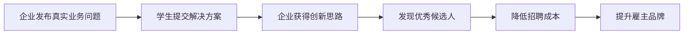
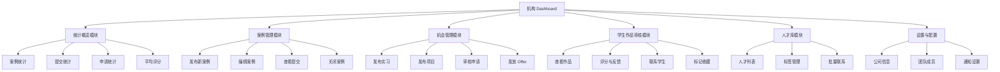
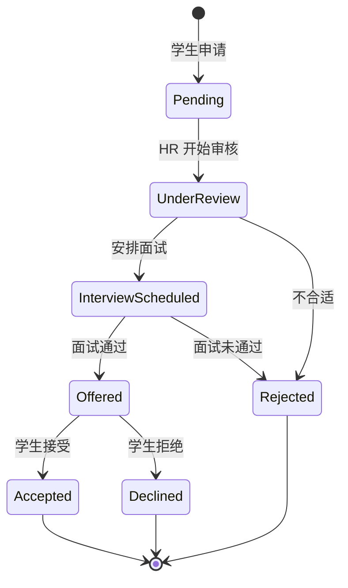

# CaseVault 机构端 Dashboard 产品开发文档

## 📋 文档信息

**文档名称**: CaseVault Organization Dashboard Product Specification  
**版本**: v1.0  
**目标读者**: 产品经理、开发工程师、UI/UX 设计师  
**创建日期**: 2026-02-12  
**关联文档**: `CASEVAULT_FEASIBILITY_ANALYSIS.md`  

---

## 一、产品概述

### 1.1 机构端定位

CaseVault 机构端是为企业/组织提供的**人才招募与创新解决方案平台**,核心价值主张:



### 1.2 目标用户画像

#### 主要用户角色

| 角色 | 职位 | 核心诉求 | 使用频率 |
|------|------|----------|----------|
| **HR 经理** | 人力资源负责人 | 招募优秀人才、降低招聘成本 | 高 (每周 3-5 次) |
| **部门主管** | 业务部门负责人 | 解决实际业务问题、获取外部创意 | 中 (每周 1-2 次) |
| **创新负责人** | 创新/数字化转型负责人 | 探索 AI 应用场景、推动内部创新 | 中 (每周 1-2 次) |

#### 用户场景示例

**场景 1: HR 经理招募人才**
```
背景：公司需要招募 2 名 AI 产品经理，但传统招聘渠道效果不佳

行为路径:
1. 登录 CaseVault → 查看 Dashboard
2. 浏览"已发布案例"的学生提交情况
3. 发现 Chen Wei-Lin 的评分高达 4.8
4. 点击查看完整作品 → 发送面试邀请
5. 成功录用，节省猎头费用 NT$60,000
```

**场景 2: 部门主管解决业务问题**
```
背景：客服团队每天处理 200+ 重复咨询，人力成本高昂

行为路径:
1. 发布案例"E-commerce Customer Service Automation"
2. 设定预估工时 15 小时、难度中级
3. 收到 18 份学生提交的 chatbot 设计方案
4. 评选出最佳方案并内部实施
5. 客服效率提升 40%
```

---

## 二、Dashboard 架构设计

### 2.1 整体布局

```
┌─────────────────────────────────────────────────────┐
│  Top Navigation Bar                                  │
│  [Logo] [📊 Dashboard] [📝 Submit Case] ...         │
├─────────────────────────────────────────────────────┤
│                                                      │
│  ┌────────────────────────────────────────────────┐ │
│  │  Welcome Back, TechCorp Inc.                    │ │
│  │  📊 Quick Stats Overview                        │ │
│  └────────────────────────────────────────────────┘ │
│                                                      │
│  ┌──────────────────┐  ┌──────────────────┐        │
│  │  Active Cases    │  │  Student         │        │
│  │  [5]             │  │  Submissions     │        │
│  │  ↑ 2 this week   │  │  [23]            │        │
│  │                  │  │  ↑ 5 new today   │        │
│  └──────────────────┘  └──────────────────┘        │
│                                                      │
│  ┌──────────────────┐  ┌──────────────────┐        │
│  │  Opportunities   │  │  Avg. Rating     │        │
│  │  Posted [3]      │  │  ⭐ 4.6/5.0      │        │
│  │  12 applicants   │  │  From 45 reviews │        │
│  └──────────────────┘  └──────────────────┘        │
│                                                      │
│  ┌─────────────────────────────────────────────────┐│
│  │  📋 Recent Case Submissions                     ││
│  │  ┌──────────────────────────────────────────┐  ││
│  │  │ Customer Review Sentiment Analysis       │  ││
│  │  │ 👤 Chen Wei-Lin · ⭐ 4.8 · NTU          │  ││
│  │  │ Built a complete automation pipeline...  │  ││
│  │  │ [View Submission] [Contact Student]      │  ││
│  │  └──────────────────────────────────────────┘  ││
│  │  ┌──────────────────────────────────────────┐  ││
│  │  │ E-commerce Customer Service Automation   │  ││
│  │  │ 👤 Lin Yu-Ting · ⭐ 4.5 · NCCU          │  ││
│  │  │ Comprehensive analysis report with...    │  ││
│  │  │ [View Submission] [Contact Student]      │  ││
│  │  └──────────────────────────────────────────┘  ││
│  └─────────────────────────────────────────────────┘│
│                                                      │
│  ┌─────────────────────────────────────────────────┐│
│  │  📌 Active Opportunities                        ││
│  │  AI Product Intern · 12 applicants · Due Apr 15││
│  │  Data Analysis Intern · 8 applicants · Due Apr 30││
│  └─────────────────────────────────────────────────┘│
└─────────────────────────────────────────────────────┘
```

### 2.2 功能模块划分



---

## 三、核心功能详细说明

### 3.1 统计概览模块 (Quick Stats)

#### 3.1.1 数据指标定义

**卡片 1: Active Cases (进行中案例)**
```typescript
interface ActiveCasesStat {
  count: number;              // 当前状态为 active 的案例数
  trend: 'up' | 'down' | 'neutral';
  trendValue: string;         // "↑ 2 this week"
  breakdown: {
    solved: number;           // 已解决
    open: number;             // 开放中
    process: number;          // 流程优化
    policy: number;           // 政策制定
    content: number;          // 内容创作
  };
}
```

**卡片 2: Student Submissions (学生提交)**
```typescript
interface StudentSubmissionsStat {
  total: number;              // 累计提交数
  newToday: number;           // 今日新增
  pendingReview: number;      // 待审核
  averageRating: number;      // 平均评分 (1-5)
  topPerformers: Array<{      // TOP 3 学生
    studentId: string;
    name: string;
    university: string;
    rating: number;
    projectTitle: string;
  }>;
}
```

**卡片 3: Opportunities Posted (已发布机会)**
```typescript
interface OpportunitiesStat {
  internship: {
    active: number;
    totalApplicants: number;
    avgTimeToFill: number;    // 平均填补天数
  };
  program: {
    active: number;
    totalApplicants: number;
    conversionRate: number;   // 申请→录取转化率
  };
}
```

**卡片 4: Average Rating (平均评分)**
```typescript
interface AverageRatingStat {
  overall: number;            // 总体评分 (1-5)
  totalReviews: number;       // 总评价数
  breakdown: {
    quality: number;          // 作品质量
    creativity: number;       // 创新性
    practicality: number;     // 实用性
    communication: number;    // 沟通表现
  };
  trend: number[];            // 近 6 个月评分趋势
}
```

#### 3.1.2 UI 交互设计

```tsx
// StatCard 组件示例
interface StatCardProps {
  title: string;
  value: string | number;
  icon: React.ElementType;
  color: 'blue' | 'green' | 'purple' | 'orange';
  trend?: {
    direction: 'up' | 'down' | 'neutral';
    label: string;
  };
  onClick?: () => void;
  footer?: React.ReactNode;
}

const StatCard: React.FC<StatCardProps> = ({
  title,
  value,
  icon: Icon,
  color,
  trend,
  onClick,
  footer
}) => {
  return (
    <div 
      className="bg-card rounded-xl shadow-sm border border-border p-6 cursor-pointer hover:shadow-md transition-shadow"
      onClick={onClick}
    >
      <div className="flex items-center justify-between">
        <div className={`p-3 rounded-lg bg-${color}-100 text-${color}-600`}>
          <Icon className="w-6 h-6" />
        </div>
        {trend && (
          <div className={`flex items-center gap-1 text-xs font-medium px-2 py-1 rounded-full ${
            trend.direction === 'up' 
              ? 'text-green-700 bg-green-50' 
              : 'text-muted-foreground bg-muted'
          }`}>
            {trend.direction === 'up' && <ArrowUpRight className="w-3 h-3" />}
            {trend.label}
          </div>
        )}
      </div>
      <div className="mt-4">
        <h3 className="text-sm font-medium text-muted-foreground">{title}</h3>
        <p className="text-2xl font-bold text-foreground mt-1">{value}</p>
      </div>
      {footer && <div className="mt-3 pt-3 border-t border-border">{footer}</div>}
    </div>
  );
};
```

---

### 3.2 案例管理模块 (Case Management)

#### 3.2.1 案例列表页

**功能清单**:
- [x] 表格展示所有案例
- [x] 筛选 (状态、部门、难度)
- [x] 搜索 (标题、关键词)
- [x] 排序 (创建时间、提交数、评分)
- [x] 批量操作 (关闭、删除)

**数据结构**:
```typescript
interface CaseListItem {
  id: string;
  title: string;
  department: string;
  category: CaseCategory;
  difficulty: DifficultyLevel;
  status: CaseStatus;
  submissions: number;
  averageRating?: number;
  createdAt: Date;
  lastSubmissionAt?: Date;
  aiBriefGenerated: boolean;
}
```

**UI 原型**:
```
┌─────────────────────────────────────────────────────┐
│  📋 Your Submitted Cases                            │
│  [Search cases...] [Filter ▼] [Sort ▼] [+ New Case]│
├─────────────────────────────────────────────────────┤
│  ☑ Title          Dept    Status  Students  Rating │
│  ─────────────────────────────────────────────────  │
│  ☐ Customer      Marketing 🟢Active  23     ⭐4.7  │
│     Review...                                     → │
│  ☐ E-commerce    Operations 🟡Open   18     ⭐4.5  │
│     Service...                                    → │
│  ☐ HR Recruitment HR      🟢Active  15     ⭐4.3   │
│     Process...                                    → │
│                                                     │
│  [Selected: 2] [Close Selected] [Delete Selected]   │
└─────────────────────────────────────────────────────┘
```

#### 3.2.2 创建案例表单 (多步骤向导)

**Step 1: 公司信息**
```typescript
interface CompanyInfoStep {
  companyName: string;          // 自动填充 (从 profile)
  industry: IndustryType;       // 下拉选择
  companySize: string;          // "1-10", "11-50", "51-200", "200+"
  department: DepartmentType;   // 下拉选择
  contactEmail: string;         // 自动填充
}
```

**Step 2: 问题描述**
```typescript
interface ProblemDescriptionStep {
  scenario: string;             // Textarea (min 500 chars)
  problem: string;              // Textarea (min 200 chars)
  existingSolution: string;     // Optional textarea
  publicData: string;           // Optional textarea
}

// 实时验证规则
const validationRules = {
  scenario: z.string()
    .min(500, "Scenario must be at least 500 characters")
    .max(2000, "Scenario cannot exceed 2000 characters"),
  problem: z.string()
    .min(200, "Problem must be at least 200 characters")
    .max(1000, "Problem cannot exceed 1000 characters"),
  existingSolution: z.string().optional(),
  publicData: z.string().optional()
};
```

**Step 3: 期望交付物**
```typescript
interface DeliverableStep {
  deliverableType: 'report' | 'prototype' | 'strategy' | 'policy' | 'creative';
  deliverableDescription: string;
  suggestedDifficulty: DifficultyLevel;
  estimatedHours: number;       // 1-100
  requiredSkills: string[];     // Tag input
}
```

**Step 4: 预览与提交**
```typescript
interface ReviewStep {
  showPreview: true;
  aiBriefPreview?: string;      // AI 生成的简报预览
  estimatedReach: number;       // 预计触达学生数
  similarCases: number;         // 类似案例数
}
```

**AI 辅助功能**:
```typescript
// AI 生成案例简报
async function generateAIBrief(caseData: CaseFormData): Promise<string> {
  const prompt = `
    Based on the following case information, generate a structured project brief:
    
    Company: ${caseData.companyName} (${caseData.industry})
    Department: ${caseData.department}
    Scenario: ${caseData.scenario}
    Problem: ${caseData.problem}
    Existing Solution: ${caseData.existingSolution}
    Expected Deliverable: ${caseData.deliverableDescription}
    
    Please structure the brief as:
    1. Project Background (2-3 paragraphs)
    2. Problem Statement (clear and specific)
    3. Success Criteria (3-5 measurable outcomes)
    4. Suggested Approach (high-level methodology)
    5. Evaluation Rubric (grading criteria)
    6. Resources Provided (data, tools, access)
  `;
  
  const response = await openai.chat.completions.create({
    model: 'gpt-4',
    messages: [{ role: 'system', content: prompt }],
    max_tokens: 1500
  });
  
  return response.choices[0].message.content;
}
```

#### 3.2.3 案例详情页

**Tab 导航结构**:
```
┌─────────────────────────────────────────────────────┐
│  Customer Review Sentiment Analysis                 │
│  Marketing Department · Active · 23 submissions     │
├─────────────────────────────────────────────────────┤
│  [Overview] [Submissions (23)] [Analytics] [Settings]│
└─────────────────────────────────────────────────────┘
```

**Overview Tab**:
- 案例完整描述
- AI 生成的项目简报
- 关键指标 (浏览量、收藏数、分享数)
- 时间线 (发布日期、最后更新)

**Submissions Tab**:
```typescript
interface SubmissionListProps {
  caseId: string;
  filter?: {
    status: 'all' | 'pending' | 'reviewed';
    rating: 'all' | '4+' | '3+';
    university: string[];
  };
  sort?: 'newest' | 'highest_rated' | 'oldest';
}

// 单个提交卡片
interface SubmissionCard {
  student: {
    id: string;
    name: string;
    university: string;
    avatar?: string;
    completedProjects: number;
    averageRating: number;
  };
  submission: {
    summary: string;
    keyFindings: string;
    demoUrl?: string;
    repositoryUrl?: string;
    submittedAt: Date;
  };
  review?: {
    rating: number;
    comment: string;
    reviewedAt: Date;
  };
  actions: ['view', 'contact', 'review', 'bookmark'];
}
```

**Analytics Tab**:
```typescript
interface CaseAnalytics {
  viewsOverTime: Array<{ date: string; views: number }>;
  submissionsOverTime: Array<{ date: string; submissions: number }>;
  demographicBreakdown: {
    byUniversity: Array<{ uni: string; count: number }>;
    byDifficulty: Array<{ level: string; count: number }>;
    bySkill: Array<{ skill: string; count: number }>;
  };
  engagementMetrics: {
    avgTimeOnPage: number;      // seconds
    bounceRate: number;         // percentage
    saveRate: number;           // percentage
    shareCount: number;
  };
}
```

---

### 3.3 机会管理模块 (Opportunity Management)

#### 3.3.1 发布实习/项目

**表单字段**:
```typescript
interface OpportunityForm {
  type: 'internship' | 'program';
  title: string;                // e.g. "AI Product Intern"
  organization: string;         // Auto-filled
  location: string;             // "Taipei / Remote"
  duration: string;             // "3 months"
  dates: string;                // "Jul - Sep 2026"
  deadline: Date;               // Application deadline
  stipend?: string;             // "NT$30,000/month" or "Free"
  description: string;          // Rich text editor
  requirements: string[];       // Tag input
  perks: string[];              // Tag input
  skillsRequired: string[];     // For matching
  benefits: string;             // Additional benefits
}
```

**智能匹配功能**:
```typescript
// 推荐匹配的学生
async function findMatchingStudents(opportunity: OpportunityForm): Promise<StudentMatch[]> {
  const students = await prisma.user.findMany({
    where: {
      role: 'STUDENT',
      projects: {
        some: {
          case: {
            skills: {
              hasSome: opportunity.skillsRequired
            }
          },
          status: 'COMPLETED',
          feedback: {
            rating: { gte: 4.0 }
          }
        }
      }
    },
    include: {
      projects: {
        where: {
          status: 'COMPLETED'
        },
        include: {
          case: true,
          feedback: true
        }
      }
    }
  });
  
  // Scoring algorithm
  return students.map(student => ({
    student,
    matchScore: calculateMatchScore(student, opportunity),
    matchedSkills: getMatchedSkills(student, opportunity),
    recommendedReason: generateRecommendationReason(student, opportunity)
  })).sort((a, b) => b.matchScore - a.matchScore);
}
```

#### 3.3.2 申请管理

**申请列表功能**:
- [ ] 筛选 (状态、学校、技能)
- [ ] 搜索 (姓名、学校、技能)
- [ ] 排序 (申请时间、匹配度)
- [ ] 批量操作 (标记为已读、拒绝)
- [ ] 导出 CSV

**申请详情页**:
```typescript
interface ApplicationDetail {
  applicant: {
    id: string;
    fullName: string;
    email: string;
    university: string;
    major: string;
    portfolioUrl?: string;
    linkedInUrl?: string;
    githubUrl?: string;
  };
  application: {
    statement: string;
    resumeUrl: string;
    relatedProjects: Array<{
      title: string;
      caseTitle: string;
      rating: number;
      url?: string;
    }>;
    appliedAt: Date;
  };
  internalNotes: string;        // Only visible to org
  evaluation: {
    fitScore: number;           // 1-10
    technicalScore: number;     // 1-10
    communicationScore: number; // 1-10
    overallComment: string;
  };
  timeline: Array<{
    action: 'applied' | 'viewed' | 'interviewed' | 'offered' | 'rejected';
    timestamp: Date;
    note?: string;
  }>;
}
```

**审核工作流**:


---

### 3.4 学生作品审核模块 (Submission Review)

#### 3.4.1 评审界面

**双栏布局**:
```
┌──────────────────────────┬──────────────────────────┐
│  Student Submission      │  Review Panel            │
├──────────────────────────┼──────────────────────────┤
│  👤 Chen Wei-Lin         │  ⭐ Rating: [4.8] ★★★★★  │
│  NTU · Computer Science  │                          │
│                          │  Quality: ⭐⭐⭐⭐⭐        │
│  📄 Project Summary      │  Creativity: ⭐⭐⭐⭐☆     │
│  Built a complete...     │  Practicality: ⭐⭐⭐⭐⭐   │
│                          │  Communication: ⭐⭐⭐⭐☆  │
│  🔗 Demo: [Link]         │                          │
│  💻 Repo: [GitHub]       │  💬 Feedback:            │
│                          │  [Textarea...]           │
│  📊 Key Findings:        │                          │
│  • Finding 1...          │  [Submit Review]         │
│  • Finding 2...          │  [Save Draft]            │
│                          │                          │
│  📎 Attachments:         │  Internal Notes:         │
│  • report.pdf            │  [Private notes...]      │
│  • presentation.pptx     │                          │
└──────────────────────────┴──────────────────────────┘
```

#### 3.4.2 评分标准

**Rubric 系统**:
```typescript
interface ReviewRubric {
  criteria: Array<{
    id: string;
    name: string;
    description: string;
    weight: number;           // 权重 (总和为 1)
    scale: {
      min: number;            // 通常 1
      max: number;            // 通常 5
      labels: Record<number, string>; // 每个分数的描述
    };
  }>;
  
  autoCalculateTotal: boolean;
  allowComments: boolean;
  requireCommentForLowScore: boolean; // <3 分必须写评论
}

// 默认 Rubric 模板
const defaultRubric: ReviewRubric = {
  criteria: [
    {
      id: 'quality',
      name: '作品质量',
      description: '技术实现完整性、代码质量、文档完善度',
      weight: 0.4,
      scale: {
        min: 1,
        max: 5,
        labels: {
          1: '未完成基本要求',
          2: '存在重大缺陷',
          3: '达到基本要求',
          4: '超出预期',
          5: '卓越表现'
        }
      }
    },
    {
      id: 'creativity',
      name: '创新性',
      description: '解决方案的新颖性、创意思维',
      weight: 0.2,
      scale: { /* ... */ }
    },
    {
      id: 'practicality',
      name: '实用性',
      description: '方案可落地性、商业价值',
      weight: 0.3,
      scale: { /* ... */ }
    },
    {
      id: 'communication',
      name: '沟通表达',
      description: '报告撰写、演示能力',
      weight: 0.1,
      scale: { /* ... */ }
    }
  ],
  autoCalculateTotal: true,
  allowComments: true,
  requireCommentForLowScore: true
};
```

#### 3.4.3 批量审核

**批量操作功能**:
```typescript
interface BulkReviewActions {
  selectMultiple: true;
  quickRating: (studentIds: string[], rating: number) => Promise<void>;
  bulkContact: (studentIds: string[], templateId: string) => Promise<void>;
  exportSelected: (studentIds: string[], format: 'csv' | 'pdf') => void;
  moveToTalentPool: (studentIds: string[]) => Promise<void>;
  rejectBulk: (studentIds: string[], reason: string) => Promise<void>;
}

// 邮件模板
interface EmailTemplate {
  id: string;
  name: string;
  subject: string;
  body: string;
  variables: string[];        // e.g. ['{{studentName}}', '{{projectTitle}}']
}

const templates: EmailTemplate[] = [
  {
    id: 'interview-invitation',
    name: '面试邀请',
    subject: '面试邀请：{{position}} @ {{company}}',
    body: `亲爱的{{studentName}}:\n\n我们对您在{{projectTitle}}中的出色表现印象深刻...`,
    variables: ['studentName', 'projectTitle', 'position', 'company']
  },
  {
    id: 'rejection-polite',
    name: '婉拒信',
    subject: '关于您的申请 - {{company}}',
    body: `感谢你对{{position}}的关注...`,
    variables: ['studentName', 'position', 'company']
  }
];
```

---

### 3.5 人才库模块 (Talent Pool)

#### 3.5.1 人才列表

**数据来源**:
- 主动联系过的学生
- 高分作品作者 (rating >= 4.5)
- 收藏的学生
- 曾经合作过的学生

**筛选维度**:
```typescript
interface TalentFilter {
  skills: string[];           // 技能标签
  universities: string[];     // 学校列表
  minRating: number;          // 最低评分
  availability: 'immediate' | 'within-month' | 'flexible';
  locationPreference: 'onsite' | 'remote' | 'hybrid';
  graduationYear: number[];   // 毕业年份
  hasPortfolio: boolean;
}
```

#### 3.5.2 人才详情页

```typescript
interface TalentProfile {
  basicInfo: {
    name: string;
    email: string;
    phone?: string;
    linkedIn: string;
    github: string;
    portfolio: string;
    location: string;
    availability: string;
  };
  
  education: {
    university: string;
    degree: string;
    major: string;
    graduationYear: number;
    gpa?: number;
  };
  
  skills: Array<{
    name: string;
    proficiency: 'beginner' | 'intermediate' | 'advanced' | 'expert';
    yearsOfExperience: number;
  }>;
  
  projects: Array<{
    title: string;
    caseTitle: string;
    role: string;
    duration: string;
    description: string;
    technologies: string[];
    rating: number;
    feedback: string;
    url?: string;
  }>;
  
  certifications: Array<{
    name: string;
    issuer: string;
    issueDate: Date;
    credentialUrl?: string;
  }>;
  
  workHistory: Array<{
    company: string;
    position: string;
    duration: string;
    description: string;
  }>;
  
  interactions: Array<{
    type: 'message' | 'application' | 'submission' | 'interview';
    date: Date;
    note?: string;
  }>;
}
```

---

### 3.6 设置与配置 (Settings)

#### 3.6.1 公司信息

```typescript
interface CompanySettings {
  basicInfo: {
    name: string;
    legalName: string;
    website: string;
    logo: string;
    coverImage: string;
    description: string;
    industry: string;
    size: string;
    foundedYear: number;
    headquarters: string;
  };
  
  contactInfo: {
    email: string;
    phone: string;
    address: string;
  };
  
  socialMedia: {
    linkedIn: string;
    twitter: string;
    facebook: string;
    instagram: string;
  };
  
  branding: {
    primaryColor: string;
    secondaryColor: string;
    tagline: string;
    values: string[];
  };
}
```

#### 3.6.2 团队管理

```typescript
interface TeamManagement {
  members: Array<{
    id: string;
    email: string;
    name: string;
    role: 'owner' | 'admin' | 'member' | 'viewer';
    permissions: {
      canPostCases: boolean;
      canReviewSubmissions: boolean;
      canPostOpportunities: boolean;
      canManageTeam: boolean;
      canViewAnalytics: boolean;
      canExportData: boolean;
    };
    joinedAt: Date;
    lastActive: Date;
  }>;
  
  inviteMember: (email: string, role: Role) => Promise<void>;
  updatePermissions: (memberId: string, permissions: Permissions) => Promise<void>;
  removeMember: (memberId: string) => Promise<void>;
}
```

#### 3.6.3 通知设置

```typescript
interface NotificationSettings {
  emailNotifications: {
    newSubmission: boolean;
    newApplication: boolean;
    submissionReviewed: boolean;
    applicationStatusChange: boolean;
    weeklyDigest: boolean;
    monthlyReport: boolean;
  };
  
  inAppNotifications: {
    mentionInComment: boolean;
    directMessage: boolean;
    systemAnnouncement: boolean;
  };
  
  notificationFrequency: 'instant' | 'hourly' | 'daily' | 'weekly';
  quietHours: {
    enabled: boolean;
    startTime: string;        // "22:00"
    endTime: string;          // "08:00"
  };
}
```

---

## 四、API 接口设计 (机构端专用)

### 4.1 认证与授权

```typescript
// 机构用户登录
POST /api/v1/auth/org-login
Request:
{
  email: string;
  password: string;
}

Response:
{
  success: true;
  data: {
    user: {
      id: string;
      email: string;
      role: 'ORGANIZATION';
      organizationId: string;
    };
    token: string;
  };
}

// 获取机构信息
GET /api/v1/organizations/:id
Response:
{
  success: true;
  data: Organization;
}
```

### 4.2 案例相关 API

```typescript
// 获取机构的所有案例
GET /api/v1/org/cases
Query Params:
  - status?: CaseStatus
  - category?: CaseCategory
  - page?: number
  - limit?: number
  - sortBy?: 'createdAt' | 'submissions' | 'rating'
  - order?: 'asc' | 'desc'

// 创建案例
POST /api/v1/org/cases
Request: CaseFormData
Response: { success: true; data: Case }

// 获取案例详情 (含权限检查)
GET /api/v1/org/cases/:id
Response: { success: true; data: CaseDetail }

// 更新案例
PUT /api/v1/org/cases/:id
Request: Partial<CaseFormData>

// 删除案例
DELETE /api/v1/org/cases/:id

// 获取案例的所有提交
GET /api/v1/org/cases/:id/submissions
Query Params:
  - status?: 'pending' | 'reviewed'
  - sortBy?: 'submittedAt' | 'rating'
  - minRating?: number

// 审核提交
POST /api/v1/org/cases/:id/submissions/:submissionId/review
Request:
{
  rating: number;
  feedback: string;
  rubricScores?: Array<{ criterionId: string; score: number }>;
  isPublic: boolean;
}
```

### 4.3 机会相关 API

```typescript
// 发布机会
POST /api/v1/org/opportunities
Request: OpportunityFormData

// 获取申请列表
GET /api/v1/org/opportunities/:id/applications
Query Params:
  - status?: ApplicationStatus
  - university?: string
  - sortBy?: 'appliedAt' | 'matchScore'

// 获取申请详情
GET /api/v1/org/applications/:id

// 更新申请状态
PATCH /api/v1/org/applications/:id/status
Request:
{
  status: ApplicationStatus;
  notes?: string;
  sendEmail?: boolean;
}

// 批量导出申请
POST /api/v1/org/opportunities/:id/applications/export
Request:
{
  format: 'csv' | 'excel';
  fields: string[];
}
```

### 4.4 统计分析 API

```typescript
// 获取 Dashboard 统计数据
GET /api/v1/org/dashboard/stats
Response:
{
  success: true;
  data: {
    activeCases: number;
    totalSubmissions: number;
    opportunitiesPosted: number;
    averageRating: number;
    recentActivity: Activity[];
  };
}

// 获取案例分析数据
GET /api/v1/org/cases/:id/analytics
Response:
{
  success: true;
  data: CaseAnalytics;
}

// 获取月度报告
GET /api/v1/org/analytics/monthly-report
Query Params:
  - month: number
  - year: number
Response:
{
  success: true;
  data: MonthlyReport;
}
```

### 4.5 人才库 API

```typescript
// 搜索人才
GET /api/v1/org/talent-pool/search
Query Params:
  - skills?: string[]
  - universities?: string[]
  - minRating?: number
  - keywords?: string
  
// 添加人才到库
POST /api/v1/org/talent-pool/:studentId
Request:
{
  tags?: string[];
  notes?: string;
}

// 获取人才详情
GET /api/v1/org/talent-pool/:studentId

// 批量联系人才
POST /api/v1/org/talent-pool/bulk-contact
Request:
{
  studentIds: string[];
  templateId: string;
  customMessage?: string;
}
```

---

## 五、UI/UX 设计规范

### 5.1 设计原则

1. **效率优先**: 减少点击次数，常用操作一键直达
2. **信息清晰**: 数据可视化，重要信息突出显示
3. **一致性**: 统一的设计语言和交互模式
4. **响应式**: 支持桌面、平板、手机

### 5.2 颜色系统

```css
/* 机构端主题色 */
:root {
  /* 主色 - 专业蓝 */
  --org-primary: #2563eb;
  --org-primary-hover: #1d4ed8;
  --org-primary-light: #dbeafe;
  
  /* 成功色 */
  --success: #10b981;
  --success-bg: #d1fae5;
  
  /* 警告色 */
  --warning: #f59e0b;
  --warning-bg: #fef3c7;
  
  /* 危险色 */
  --danger: #ef4444;
  --danger-bg: #fee2e2;
  
  /* 中性色 */
  --gray-50: #f9fafb;
  --gray-100: #f3f4f6;
  --gray-200: #e5e7eb;
  --gray-300: #d1d5db;
  --gray-400: #9ca3af;
  --gray-500: #6b7280;
  --gray-600: #4b5563;
  --gray-700: #374151;
  --gray-800: #1f2937;
  --gray-900: #111827;
}
```

### 5.3 组件库

**Button 变体**:
```tsx
type ButtonVariant = 'primary' | 'secondary' | 'outline' | 'ghost' | 'danger';
type ButtonSize = 'sm' | 'md' | 'lg';

interface ButtonProps extends React.ButtonHTMLAttributes<HTMLButtonElement> {
  variant?: ButtonVariant;
  size?: ButtonSize;
  loading?: boolean;
  leftIcon?: React.ElementType;
  rightIcon?: React.ElementType;
}
```

**Table 组件**:
```tsx
interface DataTableProps<T> {
  columns: ColumnDef<T>[];
  data: T[];
  isLoading?: boolean;
  pagination?: {
    currentPage: number;
    totalPages: number;
    onPageChange: (page: number) => void;
  };
  sorting?: {
    sortBy: string;
    order: 'asc' | 'desc';
    onSort: (key: string) => void;
  };
  filters?: React.ReactNode;
  rowSelection?: {
    selectedRows: string[];
    onSelectionChange: (ids: string[]) => void;
  };
  actions?: RowActions<T>;
}
```

---

## 六、技术实现要点

### 6.1 性能优化

**数据预取策略**:
```tsx
// 使用 React Query 缓存
const queryClient = new QueryClient({
  defaultOptions: {
    queries: {
      staleTime: 5 * 60 * 1000, // 5 分钟
      cacheTime: 30 * 60 * 1000, // 30 分钟
      refetchOnWindowFocus: false,
    },
  },
});

// Dashboard 数据预取
export function useOrgDashboardStats() {
  return useQuery(['org-stats'], fetchOrgStats, {
    staleTime: 2 * 60 * 1000,
    refetchInterval: 5 * 60 * 1000, // 每 5 分钟刷新
  });
}
```

**虚拟滚动优化大列表**:
```tsx
import { FixedSizeList } from 'react-window';

function VirtualizedSubmissionList({ submissions }: Props) {
  return (
    <FixedSizeList
      height={600}
      itemCount={submissions.length}
      itemSize={120}
      width="100%"
    >
      {({ index, style }) => (
        <SubmissionCard 
          submission={submissions[index]} 
          style={style}
        />
      )}
    </FixedSizeList>
  );
}
```

### 6.2 安全性考虑

**权限验证中间件**:
```typescript
// middleware.ts
export async function middleware(request: NextRequest) {
  const session = await auth();
  
  // 机构端路由保护
  if (request.nextUrl.pathname.startsWith('/org')) {
    if (!session?.user || session.user.role !== 'ORGANIZATION') {
      return NextResponse.redirect(new URL('/unauthorized', request.url));
    }
    
    // 额外权限检查
    const requiredPermission = getRequiredPermission(request.nextUrl.pathname);
    if (requiredPermission && !hasPermission(session.user, requiredPermission)) {
      return NextResponse.redirect(new URL('/forbidden', request.url));
    }
  }
}
```

**输入验证与清理**:
```typescript
import { z } from 'zod';

const CaseSubmissionSchema = z.object({
  title: z.string().min(10).max(150),
  scenario: z.string().min(500).max(2000),
  problem: z.string().min(200).max(1000),
  // ...
});

// XSS 防护
import DOMPurify from 'dompurify';

function sanitizeContent(html: string): string {
  return DOMPurify.sanitize(html, {
    ALLOWED_TAGS: ['p', 'br', 'strong', 'em', 'u', 'ul', 'ol', 'li'],
    ALLOWED_ATTR: []
  });
}
```

### 6.3 错误处理

**统一错误边界**:
```tsx
class ErrorBoundary extends React.Component<Props, State> {
  componentDidCatch(error: Error, errorInfo: React.ErrorInfo) {
    logErrorToService(error, errorInfo);
    
    // 显示友好错误页面
    return (
      <ErrorFallback
        error={error}
        onRetry={() => window.location.reload()}
      />
    );
  }
}
```

**API 错误处理**:
```typescript
async function handleApiError(error: unknown): Promise<never> {
  if (error instanceof ApiError) {
    switch (error.status) {
      case 401:
        redirectToLogin();
        break;
      case 403:
        showForbiddenError();
        break;
      case 404:
        showNotFoundError();
        break;
      case 422:
        throw new ValidationError(error.details);
      default:
        showGenericError();
    }
  }
  throw error;
}
```

---

## 七、测试策略

### 7.1 单元测试

```typescript
describe('Organization Dashboard', () => {
  describe('StatCard component', () => {
    it('should display correct trend indicator', () => {
      render(
        <StatCard 
          title="Active Cases"
          value={5}
          trend={{ direction: 'up', label: '+2 this week' }}
        />
      );
      
      expect(screen.getByText('+2 this week')).toBeInTheDocument();
      expect(screen.getByTestId('trend-up-icon')).toBeInTheDocument();
    });
  });
  
  describe('Case API', () => {
    it('should return cases filtered by status', async () => {
      const response = await GET(
        new Request('/api/v1/org/cases?status=ACTIVE')
      );
      const data = await response.json();
      
      expect(data.data.every((c: Case) => c.status === 'ACTIVE')).toBe(true);
    });
  });
});
```

### 7.2 集成测试

```typescript
describe('Submission Review Flow', () => {
  it('should complete review workflow', async () => {
    // 1. Login as org user
    await login(orgUser);
    
    // 2. Navigate to submission
    await page.goto('/org/cases/123/submissions/456');
    
    // 3. Fill review form
    await page.fill('[name=rating]', '4.5');
    await page.fill('[name=feedback]', 'Great work!');
    
    // 4. Submit review
    await page.click('button[type=submit]');
    
    // 5. Verify success
    await expect(page.locator('.toast-success')).toBeVisible();
    
    // 6. Verify student notified
    const email = await getLastEmail();
    expect(email.to).toBe('student@example.com');
    expect(email.subject).toContain('Your submission has been reviewed');
  });
});
```

---

## 八、上线清单

### Phase 1 MVP (4 周)

- [ ] 基础 Dashboard 框架
- [ ] 案例 CRUD 功能
- [ ] 学生提交列表
- [ ] 简单评分系统
- [ ] 基础统计卡片

### Phase 2 (3 周)

- [ ] 机会管理模块
- [ ] 申请审核流程
- [ ] 人才库功能
- [ ] 邮件通知
- [ ] 数据分析图表

### Phase 3 (3 周)

- [ ] AI 简报生成
- [ ] 批量操作
- [ ] 高级筛选
- [ ] 导出功能
- [ ] 团队协作

### Phase 4 (2 周)

- [ ] 性能优化
- [ ] 安全加固
- [ ] 移动端适配
- [ ] 文档完善
- [ ] Beta 测试

---

## 九、成功指标

### 9.1 业务指标

| 指标 | 目标值 | 测量方式 |
|------|--------|----------|
| 机构注册数 | 首月 50 家 | Google Analytics |
| 案例发布率 | 70% 注册机构发布至少 1 个案例 | Database query |
| 平均提交数 | 每个案例 15+ 提交 | Analytics |
| 机构满意度 | NPS > 50 | Survey |
| 人才转化率 | 20% 提交学生获得面试机会 | Tracking |

### 9.2 技术指标

| 指标 | 目标值 | 测量工具 |
|------|--------|----------|
| 页面加载时间 | < 2s | Lighthouse |
| API 响应时间 | P95 < 500ms | Vercel Analytics |
| 可用性 | 99.9% | Uptime monitoring |
| 错误率 | < 0.1% | Sentry |
| Core Web Vitals | All Green | Search Console |

---

## 附录

### A. 术语表

| 术语 | 定义 |
|------|------|
| Case | 企业发布的真实业务问题 |
| Submission | 学生提交的解决方案 |
| Opportunity | 实习或项目机会 |
| Application | 学生对机会的申请 |
| Rubric | 评分标准模板 |
| Talent Pool | 企业人才库 |

### B. 参考资料

- [Next.js App Router Documentation](https://nextjs.org/docs/app)
- [Prisma Best Practices](https://www.prisma.io/docs/guides)
- [Zod Schema Validation](https://zod.dev)
- [TanStack Query](https://tanstack.com/query)

---

**文档版本**: v1.0  
**最后更新**: 2026-02-12  
**审批状态**: Draft  
**下一步**: UI 设计稿评审 → 技术可行性评估 → 开发排期
