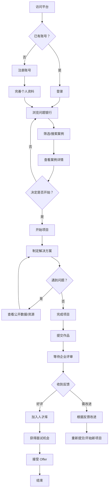
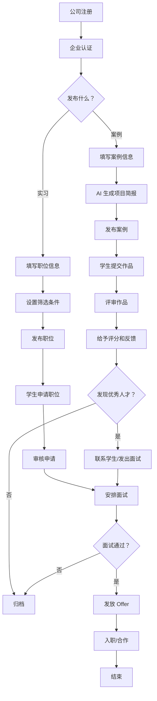

# CaseVault 平台产品需求文档 (PRD)

## 📋 文档信息

**产品名称**: CaseVault - 真实世界 AI 项目对接平台  
**文档版本**: v1.0  
**文档类型**: 产品需求文档 (PRD)  
**目标读者**: 产品团队、设计团队、运营团队  
**创建日期**: 2026-02-12  

---

## 一、产品愿景与定位

### 1.1 产品愿景

打造一个连接**企业真实业务需求**与**学生实践能力**的双边平台，让学生通过解决真实问题获得实战经验，让企业通过开放创新获得解决方案并发现优秀人才。

### 1.2 核心价值主张

**对学生**:
- 🎯 获得真实项目经验，丰富简历作品集
- 💼 接触优质企业，增加实习/就业机会
- 🏆 获得企业反馈，明确能力提升方向
- 💰 部分项目提供奖金或报酬

**对企业**:
- 💡 获得多元化创新解决方案
- 👥 低成本识别和招募优秀人才
- 🌟 提升雇主品牌在校园的影响力
- 🚀 推动内部数字化转型和创新

### 1.3 目标用户群体

#### 学生端 (Student)
- **在校大学生/研究生** (本科 2-4 年级、硕士、博士)
- **专业背景**: 计算机、数据科学、商科、工程等相关科系
- **核心诉求**: 
  - 积累项目经验，弥补课堂学习不足
  - 建立人脉网络，争取实习面试机会
  - 验证所学技能，获得业界反馈
  - 赚取额外收入或奖学金

#### 机构端 (Organization)
- **企业类型**: 
  - 科技公司 (互联网、软件、硬件)
  - 传统企业数字化转型部门
  - 咨询公司
  - 初创企业
  - 非营利组织
  
- **使用者角色**:
  - HR 经理/招聘负责人
  - 业务部门主管
  - 创新实验室负责人
  - 数字化转型负责人

---

## 二、用户故事与使用场景

### 2.1 学生端核心用户故事

#### 用户故事 1: 寻找适合的项目

**作为** 一名计算机系大三学生  
**我希望** 浏览平台上发布的案例  
**以便于** 找到与我技能和兴趣匹配的项目  

**场景描述**:
```
背景：小明是台湾大学计算机系三年级学生，已学习 Python、机器学习等课程，
      想找一些实战项目来巩固所学知识。

触发：教授在课堂上推荐了 CaseVault 平台

行为流程:
1. 访问平台首页 → 注册账号 (选择学生身份)
2. 完善个人资料 (填写学校、专业、技能标签)
3. 进入"问题银行"页面
4. 使用筛选功能:
   - 难度：中级
   - 技能：Python、机器学习
   - 类别：开放中
5. 浏览案例列表，查看感兴趣的案例
6. 点击案例卡片查看详情
7. 阅读完整的案例描述、期望交付物
8. 评估自身能力后决定开始项目

结果：成功启动项目，开始制定解决方案
```

**痛点解决**:
- ❌ 传统困境：课堂作业过于理论，缺乏实战价值
- ✅ 平台价值：真实业务场景，企业背书，成果可展示

---

#### 用户故事 2: 提交作品并获得反馈

**作为** 已完成项目的学生  
**我希望** 提交我的解决方案并获得企业评价  
**以便于** 了解自己的工作质量并改进  

**场景描述**:
```
背景：小红花了 2 周时间完成了"客户评论情感分析"项目

行为流程:
1. 登录平台 → 进入"我的项目"页面
2. 找到进行中的项目
3. 点击"提交作品"按钮
4. 填写提交表单:
   - 项目总结 (300 字)
   - 关键发现 (500 字)
   - 演示视频链接 (YouTube/Loom)
   - GitHub 仓库链接
   - 选择是否公开分享给企业
5. 预览并提交
6. 等待企业审核 (预计 3-5 个工作日)
7. 收到邮件通知：作品已评分
8. 查看详细评分和文字反馈
9. 评分 4.5/5.0，企业留下详细评语

结果：获得高质量反馈，明确改进方向，被企业标记为"优秀候选人"
```

**获得价值**:
- 📊 量化评估：清晰的能力维度评分
- 💬 质性反馈：具体优缺点分析
- 🏅 荣誉认证：高分作品获得徽章
- 📧 面试邀请：优秀者直接获得面试机会

---

#### 用户故事 3: 申请实习机会

**作为** 即将毕业的学生  
**我希望** 申请平台上的实习岗位  
**以便于** 获得全职工作机会  

**场景描述**:
```
背景：小华是研究所应届毕业生，正在寻找全职工作

行为流程:
1. 进入"实习机会"页面
2. 查看"AI 产品经理实习生"职位
3. 阅读职位要求:
   - 至少完成 2 个 AI 相关项目
   - 熟悉提示工程
   - 沟通能力强
4. 系统自动显示匹配度：85% (基于已完成项目)
5. 点击"立即申请"
6. 填写申请表:
   - 个人基本信息
   - 求职信 (为什么感兴趣)
   - 附上相关的 2 个项目作品
   - LinkedIn/GitHub 链接
7. 提交申请
8. 系统自动发送确认邮件
9. 1 周后收到 HR 面试邀请邮件
10. 通过面试获得 Offer

结果：成功获得理想公司的实习机会
```

**竞争优势**:
- 📂 作品集优势：相比传统简历更有说服力
- ⭐ 信用背书：平台评分作为能力证明
- 🎯 精准匹配：智能推荐合适岗位
- 📍 减少环节：跳过笔试直接面试

---

### 2.2 机构端核心用户故事

#### 用户故事 4: 发布业务案例

**作为** 科技公司的创新负责人  
**我希望** 在平台上发布真实的业务挑战  
**以便于** 收集外部创新思路  

**场景描述**:
```
背景：某电商公司客服部门每天处理 200+ 重复咨询，人力成本高昂

前期准备:
- 明确问题边界和期望目标
- 准备可公开的数据集 (脱敏处理)
- 预估工作量 (约 15-20 小时)
- 设定难度等级 (中级)

发布流程:
1. 注册公司账号 → 企业认证
2. 填写公司信息:
   - 公司名称、行业、规模
   - 公司 Logo、简介
   - 官网链接
3. 进入"发布案例"向导:

   **Step 1 - 基本信息**:
   - 选择部门：运营部
   - 案例类别：流程优化
   
   **Step 2 - 问题描述**:
   - 业务场景：描述客服团队现状和痛点
   - 核心问题：如何用 AI 自动化处理常见咨询
   - 已尝试方案：Zendesk  canned responses
   - 可分享数据：FAQ 文档、咨询分类样本
   
   **Step 3 - 期望产出**:
   - 交付物类型：原型 + 分析报告
   - 详细描述：Chatbot 设计方案 + ROI 分析
   - 建议难度：中级
   - 预估工时：15 小时
   - 所需技能：Chatbot、Prompt Engineering、API
   
   **Step 4 - 预览提交**:
   - AI 自动生成结构化项目简报
   - 预览完整案例描述
   - 确认发布

4. 支付发布费用 (如适用)
5. 案例上线，进入审核队列
6. 24 小时后案例公开发布

结果：案例上线 3 天收到 18 份学生提交
```

**获得价值**:
- 💡 多元视角：获得来自不同背景学生的创新方案
- 💰 成本效益：相比传统咨询费用大幅降低
- ⏱️ 效率提升：AI 辅助生成标准化简报
- 🌐 品牌曝光：提升企业在校园的知名度

---

#### 用户故事 5: 审核学生作品

**作为** HR 经理  
**我希望** 审阅学生提交的解决方案并给予评分  
**以便于** 识别优秀人才并联系面试  

**场景描述**:
```
背景：客服自动化案例收到 18 份提交，需要逐一评审

评审流程:
1. 登录 Dashboard → 查看"待审核"通知
2. 进入案例详情页 → "提交"标签
3. 查看提交列表 (按提交时间排序)
4. 逐个审阅作品:

   **审阅第一位学生 (陈伟霖)**:
   a. 查看基本信息:
      - 台湾大学 · 计算机系三年级
      - 平均评分 4.8/5.0 (历史表现优秀)
      - 已完成 5 个项目
   
   b. 阅读项目总结:
      "构建了一个完整的情感分析管道，使用 Python + 
       OpenAI API，准确率达到 92%，并提供交互式仪表板..."
   
   c. 查看关键发现:
      - 发现 1: 负面评论主要集中在物流延迟
      - 发现 2: 正面评论多与产品质量相关
      - 发现 3: 中性评论常包含改进建议
   
   d. 访问演示链接:
      - 观看 3 分钟 Demo 视频
      - 体验在线仪表板
   
   e. 检查代码质量:
      - 访问 GitHub 仓库
      - 查看代码结构、注释、README
   
   f. 评分 (五星量表):
      ⭐⭐⭐⭐⭐ 作品质量 (5/5)
      ⭐⭐⭐⭐☆ 创新性 (4/5)
      ⭐⭐⭐⭐⭐ 实用性 (5/5)
      ⭐⭐⭐⭐☆ 沟通表达 (4/5)
      
      综合评分：4.8/5.0
   
   g. 写下反馈:
      "出色的工作！技术实现完整，分析深入。建议在可视化
       部分增加更多交互元素。你的解决方案对我们很有价值，
       是否有兴趣进一步合作？"
   
   h. 标记为"优秀候选人"
   i. 发送面试邀请邮件

5. 继续审阅下一位学生
6. 完成 10 份评审后暂停
7. 导出前 3 名学生的资料给业务主管

结果：3 天内完成所有评审，发出 5 个面试邀请，录用 2 人
```

**效率工具**:
- 📝 评分模板：标准化评估维度
- ⚡ 批量操作：快速筛选和分类
- 🔖 书签功能：标记重点关注对象
- 📊 对比视图：并排比较多个作品

---

#### 用户故事 6: 管理实习招聘

**作为** 招聘负责人  
**我希望** 发布和管理实习岗位申请  
**以便于** 高效完成招聘流程  

**场景描述**:
```
背景：公司需要招聘 2 名 AI 产品实习生

发布职位:
1. 进入"发布机会"页面
2. 选择类型：实习岗位
3. 填写职位信息:
   - 职位名称：AI 产品经理实习生
   - 工作地点：台北/远程
   - 实习期：3 个月
   - 津贴：NT$30,000/月
   - 截止日期：2026 年 4 月 15 日
   
4. 撰写职位描述:
   - 工作内容：参与 AI 功能设计、用户研究
   - 任职要求：完成过 2 个以上 AI 项目
   - 加分项：有产品思维、沟通能力强
   
5. 列出福利:
   - 资深 PM 一对一指导
   - 转正机会
   - 参加行业会议预算

6. 设置筛选条件:
   - 必需技能：Prompt Engineering
   - 优先学校：台大、交大、台科大等
   - 最低评分：4.0/5.0

7. 发布职位

申请管理:
1. 收到 25 份申请
2. 进入"申请管理"页面
3. 使用智能排序:
   - 按匹配度排序 (系统算法)
   - 按评分排序
   - 按学校排序
   
4. 快速筛选:
   - 第一轮：筛掉不符合基本要求的 (剩 15 份)
   - 第二轮：仔细阅读求职信和项目经历 (剩 8 份)
   - 第三轮：查看高分作品 (剩 5 份)
   
5. 安排面试:
   - 向 5 位候选人发送面试邀请
   - 使用平台内置日历协调时间
   - 发送 Zoom 会议链接
   
6. 面试评估:
   - 填写面试反馈表
   - 团队讨论决策
   
7. 发放 Offer:
   - 向 2 位候选人发 Offer
   - 其他人发送感谢信

结果：2 周内完成招聘，入职 2 名优秀实习生
```

**招聘优势**:
- 🎯 精准触达：主动找项目的求职者
- 📋 简化流程：统一平台管理所有申请
- 🤖 智能匹配：算法推荐高契合度候选人
- 💬 即时沟通：内置消息系统

---

## 三、核心业务流程

### 3.1 学生端主流程



### 3.2 机构端主流程



### 3.3 关键子流程

#### 3.3.1 案例提交流程

```
学生视角:
开始项目 → 下载资料 → 独立研究 → 形成方案 → 制作材料 → 提交作品
                                        ↓
                                    上传内容:
                                    • 项目总结
                                    • 关键发现
                                    • Demo 视频
                                    • 代码链接
                                    • 相关附件
                                        ↓
                                    确认提交 → 收到确认邮件

企业视角:
收到提交通知 → 查看提交列表 → 下载材料 → 体验 Demo → 审查代码
                                                    ↓
                                                评审会议:
                                                • 技术可行性
                                                • 商业价值
                                                • 创新程度
                                                    ↓
                                                打分写评语 → 发送反馈
```

#### 3.3.2 实习申请流程

```
学生视角:
看到心仪职位 → 检查匹配度 → 准备申请材料 → 填写在线表格
                                            ↓
                                        申请内容:
                                        • 基本信息
                                        • 求职信
                                        • 相关作品
                                        • 推荐信 (可选)
                                            ↓
                                        提交申请 → 等待回复
                                            ↓
                                        状态更新:
                                        已提交 → 已查看 → 面试邀请 → Offer/拒绝

企业视角:
收到申请通知 → 查看申请概览 → 初筛 (自动过滤) → 细读材料
                                              ↓
                                          评估维度:
                                          • 硬技能匹配
                                          • 项目经历
                                          • 沟通能力
                                          • 文化契合度
                                              ↓
                                          标记分类:
                                          • 强烈推荐
                                          • 待定
                                          • 不合适
                                              ↓
                                          安排面试 → 发放 Offer
```

---

## 四、功能需求详细说明

### 4.1 学生端功能清单

#### 4.1.1 账户与个人资料

**注册与登录**
- 邮箱注册/登录
- 第三方登录 (Google、GitHub)
- 忘记密码找回
- 邮箱验证

**个人资料管理**
- 基本信息：姓名、头像、联系方式
- 教育背景：学校、专业、入学/毕业年份
- 技能标签：从预设库选择或自定义添加
- 自我介绍：简短的个人介绍 (500 字以内)
- 作品集链接：GitHub、LinkedIn、个人网站
- 隐私设置：控制信息可见范围

**个人仪表板**
- 进行中的项目 (含进度条)
- 已完成的 project (含评分)
- 已申请的职位 (含状态)
- 收到的消息通知
- 收藏的案例和职位

---

#### 4.1.2 问题银行 (Problem Bank)

**浏览与筛选**
- 卡片式列表展示
- 多维度筛选:
  - 案例类别 (已解决/开放中/流程优化/政策制定/内容创作)
  - 难度等级 (初级/中级/高级)
  - 所需技能 (多选)
  - 预估工时范围
  - 发布时间 (最近一周/一月等)
- 搜索功能：支持标题、公司名、部门、关键词搜索
- 排序选项：最新发布、最多提交、最高评分

**案例详情**
- 公司信息：Logo、名称、行业、规模
- 案例元数据：部门、类别、难度、预估工时
- 完整描述:
  - 业务场景 (Background)
  - 核心问题 (Problem)
  - 现有方案 (Existing Solution)
  - 期望交付物 (Deliverable)
  - 可用数据 (Public Data)
- 所需技能标签
- 提交数量提示 ("已有 X 人在做")
- 相关案例推荐

**开始项目**
- 选择团队模式：
  - 单人项目
  - 双人组队
  - 团队项目 (3-5 人)
- 填写学习目标 (可选)
- 确认预估工时和交付物
- 添加到"我的项目"

---

#### 4.1.3 项目管理

**我的项目列表**
- 状态分类：
  - 未开始
  - 进行中 (显示进度%)
  - 已提交
  - 已完成
- 快速操作：
  - 继续项目
  - 更新进度
  - 提交作品
  - 放弃项目

**进度追踪**
- 手动更新进度 (+25% 每步)
- 进度可视化 (进度条)
- 开始日期自动记录
- 里程碑提醒

**作品提交**
- 提交表单:
  - 项目总结 (必填，文本框)
  - 关键发现 (必填，文本框)
  - Demo 视频链接 (可选，URL)
  - GitHub 仓库链接 (可选，URL)
  - 其他附件上传 (可选，PDF/PPT)
  - 是否公开给企业 (单选框)
- 提交前预览
- 提交后不可修改 (但可补充材料)
- 收到提交确认邮件

**查看反馈**
- 综合评分 (1-5 星)
- 分维度评分:
  - 作品质量
  - 创新性
  - 实用性
  - 沟通表达
- 文字评语
- 评审时间
- 评审者身份 (匿名/实名)
- 下一步建议:
  - 改进方向
  - 面试邀请
  - 加入收藏

---

#### 4.1.4 实习机会

**职位浏览**
- 列表/网格视图切换
- 筛选条件:
  - 职位类型 (实习/暑期项目)
  - 地点 ( onsite/remote/hybrid)
  - 时长
  - 津贴范围
  - 截止日期
  - 目标学校
- 智能推荐：基于技能和历史项目

**职位详情**
- 公司信息
- 职位描述:
  - 工作内容
  - 任职要求
  - 加分项
  - 福利待遇
- 申请截止时间
- 当前申请人数
- 匹配度提示 ("你的技能匹配 85%")
- 相关职位推荐

**申请职位**
- 一键申请 (使用默认资料)
- 自定义申请：
  - 上传定制版简历
  - 撰写针对性求职信
  - 选择相关作品附上
  - 补充说明
- 申请状态追踪：
  - 已提交
  - 已查看
  - 面试邀请
  - Offer/拒绝
- 撤回申请功能

---

#### 4.1.5 消息与通知

**通知中心**
- 系统通知：
  - 项目提交成功
  - 作品被评审
  - 申请状态更新
  - 平台公告
- 企业消息:
  - 面试邀请
  - 补充材料请求
  - 合作邀请
- 点赞和收藏:
  - 作品被收藏
  -  profil 被查看

**消息设置**
- 邮件通知开关
- 通知频率 (实时/每日汇总/每周汇总)
- 免打扰时段设置
- 取消订阅选项

---

### 4.2 机构端功能清单

#### 4.2.1 账户与公司资料

**公司注册**
- 企业邮箱注册
- 营业执照上传 (验证用)
- 审核周期：1-2 个工作日
- 审核失败原因说明

**公司资料管理**
- 基本信息:
  - 公司名称 (中英文)
  - 官网链接
  - 行业分类
  - 公司规模区间
  - 成立年份
  - 总部地点
- 品牌元素:
  - 公司 Logo
  - 封面图片
  - 品牌色值
  - 宣传语
- 公司介绍:
  - 简短介绍 (200 字)
  - 详细介绍 (1000 字)
  - 企业文化与价值观
- 社交媒体链接
- 联系信息

**团队成员管理**
- 邀请同事加入:
  - 输入对方邮箱
  - 分配角色权限
- 角色定义:
  - 所有者 (Owner): 全部权限
  - 管理员 (Admin): 除删除账户外的所有权限
  - 成员 (Member): 发布案例、评审作品
  - 访客 (Viewer): 仅查看
- 权限矩阵:
  - 发布案例
  - 编辑案例
  - 评审提交
  - 发布职位
  - 审核申请
  - 查看数据分析
  - 导出数据
  - 管理团队

---

#### 4.2.2 案例管理

**发布新案例**
- 多步骤向导:

  **步骤 1: 公司信息确认**
  - 自动填充已保存信息
  - 选择发布部门
  
  **步骤 2: 问题描述**
  - 业务场景描述 (引导式问题):
    - "你们团队是做什么的？"
    - "当前的工作流程是怎样的？"
    - "遇到了什么具体困难？"
  - 核心问题定义:
    - "希望解决什么痛点？"
    - "成功的标准是什么？"
  - 现有方案说明:
    - "已经尝试过哪些方法？"
    - "效果如何？"
  - 可分享资源:
    - "可以提供什么数据或资料？"
    - "有哪些限制条件？"
  
  **步骤 3: 期望产出**
  - 交付物类型选择:
    - 研究报告
    - 工作原型
    - 策略建议
    - 政策文档
    - 创意方案
  - 详细描述期望:
    - "理想的解决方案是什么样的？"
    - "需要包含哪些具体内容？"
  - 难度评估建议:
    - 系统根据描述自动推荐
    - 可手动调整
  - 工时估算:
    - 提供参考范围
    - 输入具体小时数
  - 所需技能标注:
    - 从标签库选择
    - 支持自定义添加
  
  **步骤 4: 预览与发布**
    - AI 生成的项目简报预览
    - 完整案例预览
    - 预计触达学生数
    - 类似案例参考
    - 确认发布

**案例编辑**
- 随时编辑草稿
- 已发布案例的修改需重新审核
- 版本历史记录
- 关闭案例功能 (停止接收提交)

**案例列表**
- 表格展示所有案例
- 状态标识：
  - 草稿
  - 审核中
  - 已发布
  - 已关闭
- 快速查看:
  - 提交数量
  - 平均评分
  - 最后更新时间
- 批量操作:
  - 关闭多个案例
  - 删除多个案例
  - 导出案例数据

**案例数据分析**
- 概览数据:
  - 总浏览量
  - 收藏次数
  - 分享次数
  - 提交数量
- 趋势图表:
  - 每日浏览量走势
  - 提交数量随时间变化
- 人群分析:
  - 学生学校分布
  - 学生专业分布
  - 技能标签热度
- 参与度指标:
  - 平均停留时长
  - 跳出率
  - 转化率 (浏览→开始)

---

#### 4.2.3 作品评审

**提交列表**
- 查看所有提交
- 筛选条件:
  - 提交状态 (待评审/已评审)
  - 评分范围
  - 学校
  - 提交时间
- 排序选项:
  - 最新提交
  - 最高评分
  - 最旧提交
- 快速预览：悬停显示摘要

**评审界面**
- 左侧：学生提交内容
  - 个人信息卡片
  - 项目总结
  - 关键发现
  - 附件列表
  - 外部链接 (Demo、GitHub)
- 右侧：评审面板
  - 综合评分 (拖拽星星)
  - 分维度评分 (滑动条)
  - 文字评语输入框
  - 内部备注 (仅企业可见)
  - 提交评审按钮
  - 保存草稿按钮

**批量评审**
- 选择多个提交
- 快速评分 (批量打星)
- 批量发送模板消息
- 批量导出选中作品
- 批量移至人才库

**评审后操作**
- 查看历史评审记录
- 修改已提交的评审
- 联系学生 (站内信/邮件)
- 标记为"优秀候选人"
- 加入收藏夹

---

#### 4.2.4 机会管理

**发布机会**
- 选择类型：
  - 实习岗位
  - 暑期项目
  - 竞赛活动
- 填写详细信息:
  - 标题、地点、时长
  - 时间安排
  - 津贴/费用
  - 截止日期
  - 职位描述
  - 任职要求 (列表形式)
  - 福利亮点
- 设置筛选偏好:
  - 目标学校
  - 最低评分
  - 必需技能
  - 专业限制

**申请管理**
- 申请概览 Dashboard:
  - 总申请数
  - 待审核数
  - 已面试数
  - 已发 Offer 数
- 申请列表:
  - 申请人信息
  - 匹配度分数
  - 申请时间
  - 当前状态
- 申请详情:
  - 完整简历
  - 求职信
  - 附上的作品
  - 历史评分
  - 推荐人 (如有)
- 审核操作:
  - 标记为感兴趣
  - 加入备选
  - 拒绝
  - 邀请面试
- 面试安排:
  - 选择面试时间
  - 发送会议链接
  - 面试反馈表
- Offer 发放:
  - 自定义 Offer 模板
  - 设置回复截止日期
  - 跟踪接受状态

**人才库管理**
- 人才来源:
  - 主动联系过的学生
  - 高分作品作者
  - 收藏的学生
  - 面试未通过但优秀者
- 人才列表:
  - 搜索和筛选
  - 标签分类
  - 添加备注
- 批量操作:
  - 群发消息
  - 导出联系人
  - 邀请参加活动

---

#### 4.2.5 数据统计与报告

**Dashboard 概览**
- 关键指标卡片:
  - 活跃案例数
  - 学生提交总数
  - 发布机会数
  - 平均评分
  - 人才库人数
- 近期活动流:
  - 最新提交
  - 最新申请
  - 最新动态
- 快捷入口:
  - 发布案例
  - 发布机会
  - 查看待办

**月度报告**
- 自动生成每月报告
- 包含内容:
  - 本月新增案例数
  - 收到提交总数
  - 平均响应时间
  - 最佳表现案例
  - 人才获取情况
  - 下月建议
- 可下载报告 (PDF)

**数据导出**
- 导出案例数据 (CSV/Excel)
- 导出申请者名单
- 导出人才库联系人
- 自定义导出字段
- 定时自动导出

---

## 五、非功能性需求

### 5.1 用户体验要求

**易用性**
- 首次访问用户能在 3 分钟内完成注册并开始浏览
- 核心功能 (发布案例、提交作品) 操作步骤不超过 5 步
- 提供清晰的操作引导和提示
- 错误信息友好且具建设性

**一致性**
- 全站统一的设计语言和交互模式
- 相同的操作在不同页面有一致的反馈
- 术语使用一致 (如"案例"不混用"项目")

**可访问性**
- 支持键盘导航
- 图片提供替代文本
- 色彩对比度符合 WCAG 2.1 AA 标准
- 支持屏幕阅读器

---

### 5.2 性能要求

**加载速度**
- 首屏加载时间 < 3 秒
- 页面切换无明显卡顿
- 列表滚动流畅 (60fps)

**响应时间**
- 简单操作 (如点赞) 立即响应
- 表单提交后 5 秒内给出反馈
- 搜索结果显示 < 2 秒

**并发处理**
- 支持至少 1000 人同时在线
- 高峰期 (招聘季) 不崩溃
- 大量数据导入时不影响正常使用

---

### 5.3 安全与隐私

**数据安全**
- 敏感信息加密存储
- 传输使用 HTTPS
- 定期安全审计
- 防止 SQL 注入、XSS 攻击

**隐私保护**
- 明确告知数据用途
- 用户可控制信息可见性
- 不向第三方出售数据
- GDPR/个资法合规

**权限控制**
- 严格的角色权限管理
- 操作日志记录
- 异常行为检测
- 多重认证选项

---

### 5.4 内容规范

**内容审核**
- 禁止发布虚假信息
- 禁止歧视性言论
- 禁止违法违规内容
- 侵权投诉处理机制

**质量标准**
- 案例描述不少于 500 字
- 明确要求具体的交付物
- 提供真实可用的数据
- 及时回复学生提问

**社区准则**
- 尊重他人，文明交流
- 诚实守信，不夸大其词
- 保护知识产权
- 遵守学术诚信

---

## 六、产品路线图

### Phase 1: MVP (最小可行产品) - 4 周

**核心功能**:
- 用户注册/登录
- 基础个人资料
- 案例浏览和搜索
- 案例详情查看
- 开始项目
- 作品提交
- 基础评审功能
- 简单的 Dashboard

**目标**:
- 验证核心流程可行性
- 收集种子用户反馈
- 打磨基础体验

---

### Phase 2: 功能完善 - 3 周

**新增功能**:
- 实习机会模块
- 申请管理流程
- 人才库功能
- 邮件通知系统
- 数据分析图表
- 移动端优化

**目标**:
- 形成完整闭环
- 提升用户留存率
- 扩大用户规模

---

### Phase 3: 增强优化 - 3 周

**进阶功能**:
- AI 辅助生成简报
- 智能匹配推荐
- 批量操作工具
- 高级筛选器
- 导出功能
- 团队协作

**目标**:
- 提升效率
- 增加付费点
- 建立竞争壁垒

---

### Phase 4: 规模化 - 2 周

**扩展功能**:
- 多语言支持
- API 开放平台
- 第三方集成
- 高级分析报告
- 白标解决方案

**目标**:
- 拓展海外市场
- 构建生态系统
- 探索 B2B2C 模式

---

## 七、成功指标

### 7.1 用户增长指标

| 指标 | 第 1 季度目标 | 第 2 季度目标 | 第 3 季度目标 |
|------|-------------|-------------|-------------|
| 注册用户数 | 1,000 | 5,000 | 15,000 |
| 注册企业数 | 50 | 200 | 500 |
| 月活跃用户 | 300 | 2,000 | 6,000 |
| 发布案例数 | 30 | 150 | 400 |

### 7.2  engagement 指标

| 指标 | 目标值 | 测量方式 |
|------|--------|----------|
| 案例完成率 | > 60% | 完成数/开始数 |
| 作品提交率 | > 70% | 提交数/完成数 |
| 企业评审率 | > 80% | 评审数/提交数 |
| 面试转化率 | > 20% | 面试数/申请数 |
| Offer 接受率 | > 50% | 接受数/Offer 数 |
| 用户满意度 | NPS > 40 | 季度调研 |

### 7.3 质量指标

| 指标 | 目标值 | 说明 |
|------|--------|------|
| 案例平均评分 | > 4.2/5.0 | 学生评价 |
| 作品平均评分 | > 4.0/5.0 | 企业评价 |
| 投诉率 | < 1% | 投诉数/交易数 |
| 平台故障率 | < 0.1% | 故障时间/总时间 |

---

## 八、风险与应对

### 8.1 市场风险

**风险**: 双边网络效应冷启动困难

**应对策略**:
1. 种子用户计划：邀请知名企业和高校入驻
2. 内容运营：官方发布高质量案例吸引流量
3. 合作伙伴：与学校就业中心、孵化器合作
4. 激励机制：早期用户奖励 (勋章、优先推荐)

---

### 8.2 质量风险

**风险**: 案例质量参差不齐影响口碑

**应对策略**:
1. 审核机制：人工 +AI 双重审核
2. 质量标准：制定详细的发布规范
3. 举报制度：用户举报低质/虚假案例
4. 淘汰机制：下架无人问津或差评案例

---

### 8.3 安全风险

**风险**: 数据泄露、隐私侵犯

**应对策略**:
1. 技术防护：加密、防火墙、定期渗透测试
2. 权限管控：最小权限原则
3. 法律合规：遵循 GDPR、个资法
4. 应急预案：数据泄露应急响应流程

---

## 九、附录

### 9.1 术语表

| 术语 | 定义 |
|------|------|
| Case | 企业发布的真实业务问题/挑战 |
| Submission | 学生提交的解决方案 |
| Opportunity | 实习岗位或暑期项目 |
| Application | 学生对机会的申请 |
| Rubric | 评分标准模板 |
| Talent Pool | 企业收藏的人才库 |

### 9.2 参考资料

- 竞品分析报告
- 用户调研报告
- 市场调研数据
- 相关法律法规

---

**文档版本**: v1.0  
**最后更新**: 2026-02-12  
**审批状态**: 待评审  
**下次更新**: 根据用户反馈和数据分析持续迭代
